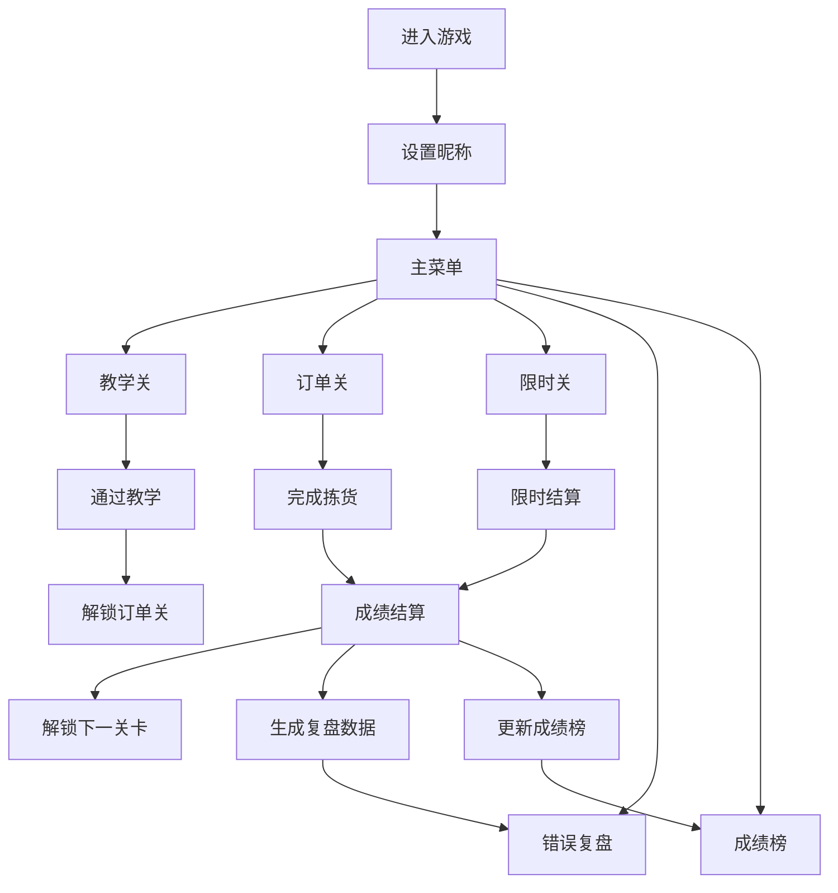

## 1. 产品概述
仓库拣货训练桌面游戏是一款面向新入职仓库员工的轻量级模拟训练工具，通过沉浸式游戏化体验帮助员工快速熟悉库位布局、拣货流程和操作规范。

- 核心价值：降低培训成本、缩短上岗周期、减少实操错误、标准化拣货流程
- 目标用户：电商仓储、物流配送中心、零售仓库的新入职拣货员

## 2. 核心功能

### 2.1 用户角色
| 角色 | 注册方式 | 核心权限 |
|------|----------|----------|
| 培训学员 | 本地昵称登录 | 关卡训练、成绩记录、复盘学习 |
| 管理员（扩展） | 管理员账号 | 查看学员成绩、自定义关卡配置 |

### 2.2 功能模块
1. **主菜单页**：关卡选择入口、成绩榜入口、个人信息展示
2. **教学关**：基础操作引导、库位识别讲解、拣货流程演示
3. **订单关**：标准订单拣货训练、多难度递进
4. **限时关**：压力测试、限时完成多订单任务
5. **错误复盘**：错拣漏拣分析、正确路径对比、操作回放
6. **成绩榜**：个人历史记录、关卡排行、能力雷达图

### 2.3 页面详情
| 页面名称 | 模块名称 | 功能描述 |
|----------|----------|----------|
| 主菜单页 | 关卡选择面板 | 展示5个模块入口、关卡解锁状态、完成进度 |
| 主菜单页 | 个人信息卡 | 显示玩家昵称、累计训练时长、综合评分 |
| 主菜单页 | 快速入口 | 继续上次训练、随机挑战按钮 |
| 教学关 | 步骤引导区 | 高亮下一步操作、语音/文字双提示 |
| 教学关 | 知识弹窗 | 库位编码规则讲解、安全操作须知 |
| 教学关 | 互动练习区 | 虚拟键盘输入货位号、拖动商品入箱 |
| 订单关 | 库区地图 | 2D俯视货架布局、当前位置标记、目标货位高亮 |
| 订单关 | 订单清单 | 待拣商品列表、数量需求、临期品标识 |
| 订单关 | 拣货操作区 | 商品扫描模拟、周转箱状态、操作反馈动效 |
| 订单关 | HUD信息栏 | 计时器、准确率、路径评分、当前关卡目标 |
| 限时关 | 倒计时显示 | 大字体醒目倒计时、颜色预警机制 |
| 限时关 | 多订单队列 | 订单优先级排序、批量合并提示 |
| 限时关 | 事件通知 | 补货干扰事件弹窗、临时变更通知 |
| 错误复盘 | 错误列表 | 错拣/漏拣/多拣分类统计、错误位置标记 |
| 错误复盘 | 路径对比 | 玩家路径vs最优路径可视化对比 |
| 错误复盘 | 操作回放 | 时间轴控制、速度调节、关键帧跳转 |
| 成绩榜 | 历史记录 | 各关卡成绩、时间趋势折线图 |
| 成绩榜 | 能力分析 | 速度/准确率/路径规划/应急处理四维雷达图 |
| 成绩榜 | 关卡排行 | 本地排行榜TOP10、最佳成绩展示 |

## 3. 核心流程

玩家从主菜单选择关卡模式，根据难度解锁机制依次挑战。在游戏中通过键盘/鼠标在虚拟库区移动，对照订单清单扫描对应货位商品放入周转箱，系统实时记录操作数据。关卡结束后结算成绩，错误可复盘回放，成绩自动入库排行榜。

## 4. 用户界面设计

### 4.1 设计风格
- **主色调**：工业蓝（#1E3A5F）+ 安全橙（#FF6B35）+ 中性灰，营造专业仓库氛围
- **辅助色**：成功绿（#10B981）、警告黄（#F59E0B）、错误红（#EF4444）
- **按钮风格**：立体悬浮按钮，圆角8px，悬停上浮+阴影加深效果
- **字体**：标题用"JetBrains Mono"等宽字体（模拟仓储终端感），正文用"Noto Sans SC"
- **布局风格**：卡片式模块化布局，HUD信息层叠式显示，地图居中主导
- **图标/emoji**：FontAwesome 工业/物流图标 + 📦🚚⏱️🎯 等仓储相关emoji

### 4.2 页面设计概要
| 页面名称 | 模块名称 | UI元素 |
|----------|----------|--------|
| 主菜单页 | 背景 | 仓库货架线稿透视背景 + 渐变叠加 + 动态扫描线效果 |
| 主菜单页 | 模块卡片 | 5张大卡片悬浮排列，不同主色调区分，hover时3D翻转预览 |
| 游戏场景 | 库区地图 | 2D网格布局，货架深灰方块，通道浅灰，玩家位置脉冲光晕，目标货位呼吸高亮 |
| 游戏场景 | HUD面板 | 左上角计时器、右上角准确率、左下角订单、右下角操作提示，半透明毛玻璃 |
| 游戏场景 | 操作反馈 | 扫描成功绿光涟漪、错误红色抖动、放入周转箱3D弹跳动画 |
| 错误复盘 | 路径对比 | 双色折线叠加，玩家路径橙色、最优路径绿色，关键节点标注 |
| 成绩榜 | 雷达图 | 四象限能力图，当前成绩蓝色填充，历史最佳灰色参照 |

### 4.3 响应式
- 桌面优先设计（最小支持1280x720）
- 主游戏区固定16:9比例，自适应缩放
- HUD元素采用相对定位，保证信息层级清晰
- 支持全屏模式切换

### 4.4 动效设计
- 页面切换：左滑进入 + 渐显
- 货架扫描：激光扫描线上下扫动
- 商品入箱：抛物线运动 + 箱子震动
- 倒计时预警：<10s时背景脉冲红光、数字抖动
- 路径移动：玩家图标逐格平滑移动、轨迹拖尾淡出
