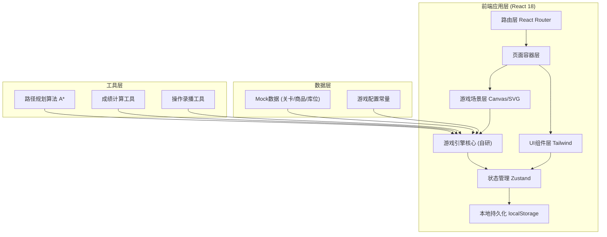
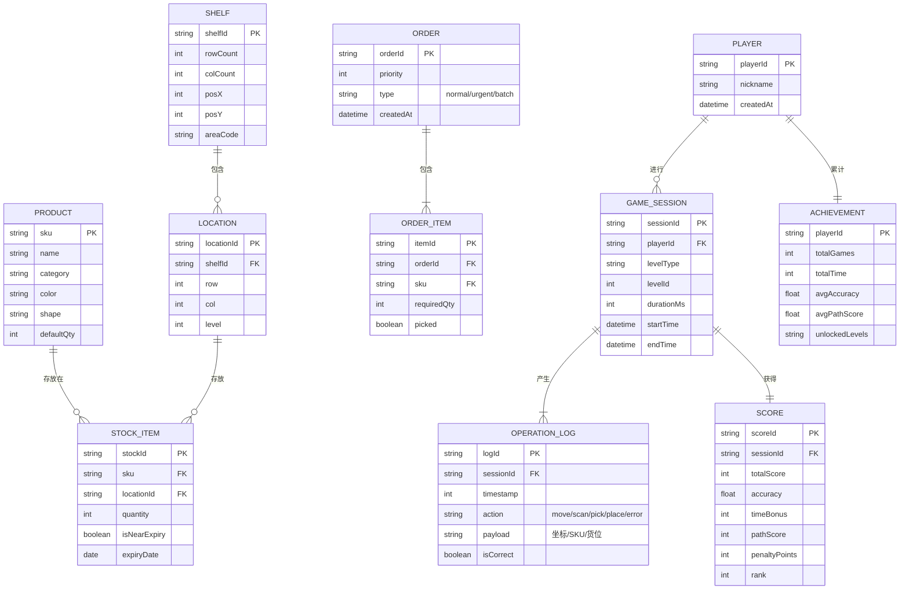

## 1. 架构设计


## 2. 技术说明
- **前端框架**：React@18.2.0 + TypeScript@5 + Vite@5
- **样式方案**：TailwindCSS@3.4 + PostCSS + Autoprefixer
- **状态管理**：Zustand@4（轻量、简洁、支持中间件持久化）
- **路由方案**：React Router Dom@6
- **图表渲染**：Recharts@2（成绩趋势图、雷达图）
- **动画方案**：Framer Motion@11（UI动效）+ CSS Animation（游戏特效）
- **地图渲染**：纯 SVG（2D库区地图，交互便捷）+ Canvas（特效叠加层）
- **图标方案**：Lucide React（简洁现代图标库）
- **代码规范**：ESLint + Prettier
- **后端/数据库**：无后端，全部使用localStorage本地持久化 + 内置Mock数据

## 3. 路由定义
| 路由路径 | 页面组件 | 用途说明 |
|----------|----------|----------|
| `/` | MainMenu | 主菜单：模块入口、关卡选择 |
| `/tutorial` | TutorialLevel | 教学关：引导式训练 |
| `/order` | OrderLevel | 订单关：标准拣货训练 |
| `/timed` | TimedLevel | 限时关：限时压力测试 |
| `/review/:sessionId` | ReviewPage | 错误复盘：指定场次回放 |
| `/leaderboard` | Leaderboard | 成绩榜：排行与能力分析 |

## 4. 数据模型

### 4.1 核心数据模型


### 4.2 Mock数据结构（内置）
- **商品库**：30+ SKU，涵盖日用品、电子产品、食品、服装4大类，每类有独特视觉标识
- **库区布局**：20m x 15m仓库，6排货架，每排5层x8列，共240个货位
- **关卡配置**：教学关5步、订单关10个难度等级、限时关6个难度等级
- **临期品规则**：按比例8%随机生成临期品，有特殊红色角标标识

## 5. 游戏引擎核心模块

### 5.1 路径规划模块
- A*算法计算最优路径（曼哈顿距离启发式）
- 支持货架避让、通道约束
- 路径评分 = （最优路径步数 / 玩家实际步数）× 基础分

### 5.2 操作判定模块
- 扫描判定：玩家位置必须在货位±1格范围内
- 商品判定：对比SKU+数量+临期优先级
- 错拣类型：货位错误、SKU错误、数量错误、顺序错误

### 5.3 事件系统模块
- 补货干扰：随机10%概率触发，锁定货位3秒
- 批量订单合并：相同区域订单自动建议合并拣货
- 临期优先提示：当普通品和临期品同SKU可拣时优先提示

### 5.4 录播回放模块
- 每步操作记录（时间戳+坐标+动作+结果）
- 支持0.5x/1x/2x倍速播放
- 关键错误点书签跳转
- 路径轨迹可视化

### 5.5 成绩计算模块
```
总分 = 基础完成分(200) 
     + 时间奖励分(最多200，提前比例×200)
     + 准确率分(准确率×300)
     + 路径规划分(路径效率×200)
     + 临期正确奖励(+20/次)
     - 错拣扣分(-30/次)
     - 漏拣扣分(-50/次)
     - 补货干扰处理得当奖励(+15/次)
```
